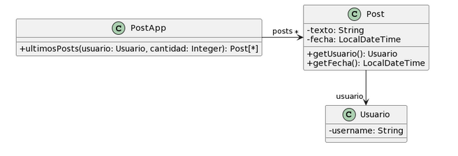

# Ejercicio 6: 

Para cada una de las siguientes situaciones, realice en forma iterativa los siguientes pasos:
(i) indique el mal olor,
(ii) indique el refactoring que lo corrige, 
(iii) aplique el refactoring, mostrando el resultado final (código y/o diseño según corresponda). 
Si vuelve a encontrar un mal olor, retorne al paso (i). 

## 6.3 Publicaciones

```java
/**
* Retorna los últimos N posts que no pertenecen al usuario user
*/
public List<Post> ultimosPosts(Usuario user, int cantidad) {
        
    List<Post> postsOtrosUsuarios = new ArrayList<Post>();
    for (Post post : this.posts) {
        if (!post.getUsuario().equals(user)) {
            postsOtrosUsuarios.add(post);
        }
    }
        
   // ordena los posts por fecha
   for (int i = 0; i < postsOtrosUsuarios.size(); i++) {
       int masNuevo = i;
       for(int j= i +1; j < postsOtrosUsuarios.size(); j++) {
           if (postsOtrosUsuarios.get(j).getFecha().isAfter(
     postsOtrosUsuarios.get(masNuevo).getFecha())) {
              masNuevo = j;
           }    
       }
      Post unPost = postsOtrosUsuarios.set(i,postsOtrosUsuarios.get(masNuevo));
      postsOtrosUsuarios.set(masNuevo, unPost);    
   }
        
    List<Post> ultimosPosts = new ArrayList<Post>();
    int index = 0;
    Iterator<Post> postIterator = postsOtrosUsuarios.iterator();
    while (postIterator.hasNext() &&  index < cantidad) {
        ultimosPosts.add(postIterator.next());
    }
    return ultimosPosts;
}
```
### Solución:
* **(i) Mal olor:** **Comments** e **Imperative Loops:**: El comentario `// ordena los posts por fecha` está tapando un bloque de código complejo y difícil de leer (un algoritmo con dos bucles `for` anidados). 
* **(ii) Refactoring:** **Replace Loop with Pipeline**: Reemplazamos ese algoritmo por streams, que es más clara y eficiente. 
* **(iii) Resultado:**
```java
public List<Post> ultimosPosts(Usuario user, int cantidad) {
    List<Post> postsOtrosUsuarios = new ArrayList<Post>();
    for (Post post : this.posts) {
        if (!post.getUsuario().equals(user)) {
            postsOtrosUsuarios.add(post);
        }
    }
        
    postsOtrosUsuarios.sort((p1, p2) -> p2.getFecha().compareTo(p1.getFecha()));
        
    List<Post> ultimosPosts = new ArrayList<Post>();
    int index = 0;
    Iterator<Post> postIterator = postsOtrosUsuarios.iterator();
    while (postIterator.hasNext() &&  index < cantidad) {
        ultimosPosts.add(postIterator.next());
        index++; 
    }
    return ultimosPosts;
}
```
### Solución:
* **(i) Mal olor:** **Long Method**: Aunque se mejoro el ordenamiento, el método sigue siendo largo porque está haciendo tres cosas distintas: (1) Filtrar usuarios, (2) Ordenar por fecha, (3) Limitar la cantidad.
* **(ii) Refactoring:** **Extraxt Method**: Se puede separar estas tres responsabilidades en métodos para que el método principal tenga su responsabilidad.
* **(iii) Resultado:**
```java
public List<Post> ultimosPosts(Usuario user, int cantidad) {
    List<Post> postsOtrosUsuarios = this.filtrarPostsDeOtrosUsuarios(user);
    this.ordenarPorFechaDescendente(postsOtrosUsuarios);
    return this.limitarCantidad(postsOtrosUsuarios, cantidad);
}

private List<Post> filtrarPostsDeOtrosUsuarios(Usuario user) {
    List<Post> filtrados = new ArrayList<>();
    for (Post post : this.posts) {
        if (!post.getUsuario().equals(user)) {
            filtrados.add(post);
        }
    }
    return filtrados;
}

private void ordenarPorFechaDescendente(List<Post> posts) {
    posts.sort((p1, p2) -> p2.getFecha().compareTo(p1.getFecha()));
}

private List<Post> limitarCantidad(List<Post> posts, int cantidad) {
    List<Post> limitados = new ArrayList<>();
    for (int i = 0; i < Math.min(posts.size(), cantidad); i++) {
        limitados.add(posts.get(i));
    }
    return limitados;
}
```
### Solución:
* **(i) Mal olor:** **Imperative Loops**: Los metodos `filtrarPostsDeOtrosUsuarios` y `limitarCantidad` pueden simplificarse usando streams en vez de for
* **(ii) Refactoring:** **Replace Loop with Pipeline**: se reemplazan los for por la API Streams.
* **(iii) Resultado:**
```java
public List<Post> ultimosPosts(Usuario user, int cantidad) {
    List<Post> postsOtrosUsuarios = this.filtrarPostsDeOtrosUsuarios(user);
    this.ordenarPorFechaDescendente(postsOtrosUsuarios);
    return this.limitarCantidad(postsOtrosUsuarios, cantidad);
}

private List<Post> filtrarPostsDeOtrosUsuarios(Usuario user) {
    return this.posts.stream()
            .filter(post -> !post.getUsuario().equals(user))
            .collect(Collectors.toList());
}

private void ordenarPorFechaDescendente(List<Post> posts) {
    posts.sort((p1, p2) -> p2.getFecha().compareTo(p1.getFecha()));
}

private List<Post> limitarCantidad(List<Post> posts, int cantidad) {
   return posts.stream()
            .limit(cantidad)
            .collect(Collectors.toList());
}
```
