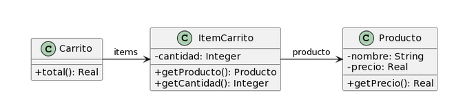

# Ejercicio 6: 

Para cada una de las siguientes situaciones, realice en forma iterativa los siguientes pasos:
(i) indique el mal olor,
(ii) indique el refactoring que lo corrige, 
(iii) aplique el refactoring, mostrando el resultado final (código y/o diseño según corresponda). 
Si vuelve a encontrar un mal olor, retorne al paso (i). 

## 6.4 Carrito de compras
```java
public class Producto {
    private String nombre;
    private double precio;
    
    public double getPrecio() {
        return this.precio;
    }
}

public class ItemCarrito {
    private Producto producto;
    private int cantidad;
        
    public Producto getProducto() {
        return this.producto;
    }
    
    public int getCantidad() {
        return this.cantidad;
    }

}

public class Carrito {
    private List<ItemCarrito> items;
    
    public double total() {
return this.items.stream()
.mapToDouble(item -> 
item.getProducto().getPrecio() * item.getCantidad())
.sum();
    }
}
```
### Solución:
* **(i) Mal olor:** **MessageChains/FeatureEnvy** : El metodo `total` de la clase  `Carrito` tiene una cadena de getters de otros objetos, El carrito envidia los datos del ítem, cuando en realidad el ítem debería ser el responsable de calcular su propio subtotal. 
* **(ii) Refactoring:** **Extract Method** de la lógica de multiplicación, seguido de **Move Method**  para trasladar ese comportamiento hacia la clase `ItemCarrito`. 
```java
public class Producto {
    private String nombre;
    private double precio;

    public double getPrecio() {
        return this.precio;
    }
}

public class ItemCarrito {
    private Producto producto;
    private int cantidad;

    public Producto getProducto() {
        return this.producto;
    }

    public int getCantidad() {
        return this.cantidad;
    }

    public double subtotal() {
        return this.producto.getPrecio() * this.cantidad;
    }
}

public class Carrito {
    private List<ItemCarrito> items;

    public double total() {
        return this.items.stream()
            .mapToDouble(item -> item.subtotal()) 
            .sum();
    }
}
```
