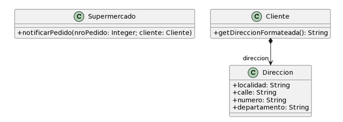

# Ejercicio 6: 

Para cada una de las siguientes situaciones, realice en forma iterativa los siguientes pasos:
(i) indique el mal olor,
(ii) indique el refactoring que lo corrige, 
(iii) aplique el refactoring, mostrando el resultado final (código y/o diseño según corresponda). 
Si vuelve a encontrar un mal olor, retorne al paso (i). 

## 6.5 Envío de Pedidos
```java
public class Supermercado {
   public void notificarPedido(long nroPedido, Cliente cliente) {
     String notificacion = MessageFormat.format(“Estimado cliente, se le informa que hemos recibido su pedido con número {0}, el cual será enviado a la dirección {1}”, new Object[] { nroPedido, cliente.getDireccionFormateada() });

     // lo imprimimos en pantalla, podría ser un mail, SMS, etc..
    System.out.println(notificacion);
  }
}

public class Cliente {
   public String getDireccionFormateada() {
	return 
		this.direccion.getLocalidad() + “, ” +
		this.direccion.getCalle() + “, ” +
		this.direccion.getNumero() + “, ” +
		this.direccion.getDepartamento()
      ;
}
```
* **(i) Mal olor detectado:** **Feature Envy** (Envidia de Funciones) y **Inappropriate Intimacy** (Intimidad Inapropiada). 
  El método `getDireccionFormateada()` de la clase `Cliente` hace cuatro llamadas consecutivas a su atributo `direccion` (`getLocalidad()`, `getCalle()`, `getNumero()`, `getDepartamento()`). El `Cliente` no está aportando ningún valor real; solo está extrayendo los datos de otro objeto para armar un texto. El responsable de saber cómo se formatea una dirección debería ser la clase `Direccion`.
* **(ii) Refactoring:** **Move Method** (Mover Método). Trasladaremos la lógica de formateo hacia la clase `Direccion`. El `Cliente` simplemente aplicará **Hide Delegate** delegándole la llamada.
* **(iii) Resultado:**
```java
public class Direccion {
    public String localidad;
    public String calle;
    public String numero;
    public String departamento;

    public String __toString() {
        return this.localidad + ", " + 
               this.calle + ", " + 
               this.numero + ", " + 
               this.departamento;
    }
}

public class Cliente {
    private Direccion direccion;

    public String getDireccionFormateada() {
        return this.direccion.__toString();
    }
}

public class Supermercado {
   public void notificarPedido(long nroPedido, Cliente cliente) {
     String notificacion = MessageFormat.format("Estimado cliente, se le informa que hemos recibido su pedido con número {0}, el cual será enviado a la dirección {1}", new Object[] { nroPedido, cliente.getDireccionFormateada() });

    System.out.println(notificacion);
  }
}
```
* **(i) Mal olor detectado:** **Public Field**. La clase `Direccion()` tiene todos sus atributos publicos, lo que rompe el encapsulamiento.
* **(ii) Refactoring:** **Encapsulate Field**. Ponemos los atributos privados y sus getters/setters correspondientes.
* **(iii) Resultado:**
```java
public class Direccion {
    private String localidad;
    private String calle;
    private String numero;
    private String departamento;

    public String __toString() {
        return this.localidad + ", " + 
               this.calle + ", " + 
               this.numero + ", " + 
               this.departamento;
    }
}

public class Cliente {
    private Direccion direccion;

    public String getDireccionFormateada() {
        return this.direccion.__toString();
    }
}

public class Supermercado {
   public void notificarPedido(long nroPedido, Cliente cliente) {
     String notificacion = MessageFormat.format("Estimado cliente, se le informa que hemos recibido su pedido con número {0}, el cual será enviado a la dirección {1}", new Object[] { nroPedido, cliente.getDireccionFormateada() });

    System.out.println(notificacion);
  }
}
```
