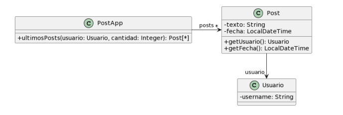

# Ejercicio 2
**Para cada una de las siguientes situaciones, realice en forma iterativa los siguientes pasos:**
1. indique el mal olor, <br/>
2. indique el refactoring que lo corrige, <br/> 
3. aplique el refactoring, mostrando el resultado final (código y/o diseño según corresponda). <br/>
> Si vuelve a encontrar un mal olor, retorne al paso (i).


## 2.3 Posts
```java
/**
* Retorna los últimos N posts que no pertenecen al usuario user
*/
public List<Post> ultimosPosts(Usuario user, int cantidad) {
  List<Post> postsOtrosUsuarios = new ArrayList<Post>();
  for (Post post : this.posts) {
    if (!post.getUsuario().equals(user)) {
      postsOtrosUsuarios.add(post);
    }
  }
  // ordena los posts por fecha
  for (int i = 0; i < postsOtrosUsuarios.size(); i++) {
    int masNuevo = i;
    for(int j= i +1; j < postsOtrosUsuarios.size(); j++) {
      if (postsOtrosUsuarios.get(j).getFecha().isAfter(
        postsOtrosUsuarios.get(masNuevo).getFecha())) {
          masNuevo = j;
        }
    }
    Post unPost = postsOtrosUsuarios.set(i,postsOtrosUsuarios.get(masNuevo));
    postsOtrosUsuarios.set(masNuevo, unPost);
  }
  List<Post> ultimosPosts = new ArrayList<Post>();
  int index = 0;
  Iterator<Post> postIterator = postsOtrosUsuarios.iterator();
  while (postIterator.hasNext() && index < cantidad) {
    ultimosPosts.add(postIterator.next());
  }
  return ultimosPosts;
}
```
- - - 
## Refactor 1 
### **Bad Smell:** Long Method
El método `ultimosPosts` es muy largo y tiene muchas funcionalidades, podría separarse en distintos métodos para que quede un código mas legible.
### **Refactoring:** Extract Method
Creo 3 métodos para separar las funcionalidades de acuerdo a los 3 bloques de código que tiene el método grande:  `getPostsOtrosUsuarios`, `ordenarPostsPorFecha` y `getUltimosNPosts`.
```java
/**
* Retorna los últimos N posts que no pertenecen al usuario user
*/
public List<Post> ultimosPosts(Usuario user, int cantidad) {
   List<Post> postsOtrosUsuarios = getPostsOtrosUsuarios(usuario);
   // ordena los posts por fecha
   postOtrosUsuarios = ordenarPostsPorFecha(postOtrosUsuarios);
   return getUltimosNPosts(postOtrosUsuarios, cantidad);
}

private List<Posts> getPostsOtrosUsuarios(Usuario user)
{
    List<Post> postsOtrosUsuarios = new ArrayList<Post>();
    for (Post post : this.posts) {
        if (!post.getUsuario().equals(user)) {
          postsOtrosUsuarios.add(post);
        }
    }
}
          
private List<Posts> ordenarPostsPorFecha(List<Posts> postsOtrosUsuarios)
{
     for (int i = 0; i < postsOtrosUsuarios.size(); i++) {
          int masNuevo = i;
          for(int j= i +1; j < postsOtrosUsuarios.size(); j++) {
            if (postsOtrosUsuarios.get(j).getFecha().isAfter(
              postsOtrosUsuarios.get(masNuevo).getFecha())) {
                masNuevo = j;
              }
          }
          Post unPost = postsOtrosUsuarios.set(i,postsOtrosUsuarios.get(masNuevo));
          postsOtrosUsuarios.set(masNuevo, unPost);
    }
}

private List<Posts> getUltimosNPosts(List<Posts> postsOtrosUsuarios, int cantidad)
{
      List<Post> ultimosPosts = new ArrayList<Post>();
      int index = 0;
      Iterator<Post> postIterator = postsOtrosUsuarios.iterator();
      while (postIterator.hasNext() && index < cantidad) {
        ultimosPosts.add(postIterator.next());
      }
      return ultimosPosts;
}

```
