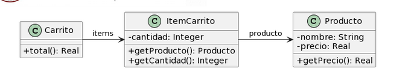

# Ejercicio 2
**Para cada una de las siguientes situaciones, realice en forma iterativa los siguientes pasos:**
1. indique el mal olor, <br/>
2. indique el refactoring que lo corrige, <br/> 
3. aplique el refactoring, mostrando el resultado final (código y/o diseño según corresponda). <br/>
> Si vuelve a encontrar un mal olor, retorne al paso (i).


## 2.4 Carrito de compras
```java
public class Producto {
    private String nombre;
    private double precio;
    
    public double getPrecio() {
        return this.precio;
    }
}

public class ItemCarrito {
    private Producto producto;
    private int cantidad;
        
    public Producto getProducto() {
        return this.producto;
    }
    
    public int getCantidad() {
        return this.cantidad;
    }

}

public class Carrito {
    private List<ItemCarrito> items;
    
    public double total() {
        return this.items.stream()
        .mapToDouble(item -> 
        item.getProducto().getPrecio() * item.getCantidad())
        .sum();
    }
}
```
- - - 
## Refactor 1 
### **Bad Smell:**
 `` 
### **Refactoring:** 