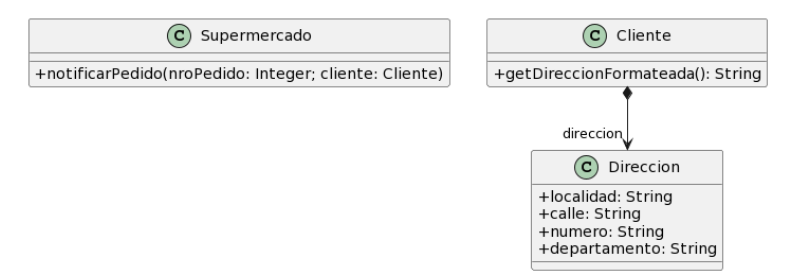

# Ejercicio 2
**Para cada una de las siguientes situaciones, realice en forma iterativa los siguientes pasos:**
1. indique el mal olor, <br/>
2. indique el refactoring que lo corrige, <br/> 
3. aplique el refactoring, mostrando el resultado final (código y/o diseño según corresponda). <br/>
> Si vuelve a encontrar un mal olor, retorne al paso (i).


## 2.5 Envio de Pedidos
```java
public class Supermercado {
    public void notificarPedido(long nroPedido, Cliente cliente) {
        String notificacion = MessageFormat.format(“Estimado cliente, se le informa que hemos recibido su pedido con número {0}, el cual será enviado a la dirección {1}”, new Object[] { nroPedido, cliente.getDireccionFormateada() });
        // lo imprimimos en pantalla, podría ser un mail, SMS, etc..
    System.out.println(notificacion);
  }
}

public class Cliente {
  public String getDireccionFormateada() {
    return 
      this.direccion.getLocalidad() + “, ” +
      this.direccion.getCalle() + “, ” +
      this.direccion.getNumero() + “, ” +
      this.direccion.getDepartamento()
    ;
  }
}
```
- - - 
## Refactor 1 
### **Bad Smell:** Middle Man
La clase `Cliente` solo esta actuando como intermediario entre `Supermercado` y `Direccion`
### **Refactoring:** Remove Middle Man
Elimino la clase `Direccion` para que quede mas entendible el esquema, y muevo los atributos que tenia direccion a `Cliente` para que no quede una clase sin nada.
```java
public class Supermercado {
    public void notificarPedido(long nroPedido, Cliente cliente) {
        String notificacion = MessageFormat.format(“Estimado cliente, se le informa que hemos recibido su pedido con número {0}, el cual será enviado a la dirección {1}”, new Object[] { nroPedido, cliente.getDireccionFormateada() });
        // lo imprimimos en pantalla, podría ser un mail, SMS, etc..
    System.out.println(notificacion);
  }
}

public class Cliente {
  public String localidad;
  public String calle;
  public String numero;
  public String departamento;

  public String getDireccionFormateada() {
    return 
      this.getLocalidad() + “, ” +
      this.getCalle() + “, ” +
      this.getNumero() + “, ” +
      this.getDepartamento()
    ;
  }
}
```
## Refactor 2
### **Bad Smell:** Rompe el encapsulamiento
La clase `Cliente` tiene todos sus atributos publicos, lo cual rompe el encapsulamiento
### **Refactoring:** Encapsulate Field
Pongo todos sus atributos como privados, y normalmente se crearìan los getters y setters pero como en el contexto del ejercicio no se utilizan no los pongo.
```java
public class Supermercado {
  public void notificarPedido(long nroPedido, Cliente cliente) {
    String notificacion = MessageFormat.format(“Estimado cliente, se le informa que hemos recibido su pedido con número {0}, el cual será enviado a la dirección {1}”, new Object[] { nroPedido, cliente.getDireccionFormateada() });
    // lo imprimimos en pantalla, podría ser un mail, SMS, etc..
    System.out.println(notificacion);
  }
}

public class Cliente {
  private String localidad;
  private String calle;
  private String numero;
  private String departamento;

  public String getDireccionFormateada() {
    return 
      this.getLocalidad() + “, ” +
      this.getCalle() + “, ” +
      this.getNumero() + “, ” +
      this.getDepartamento()
    ;
  }
}
```