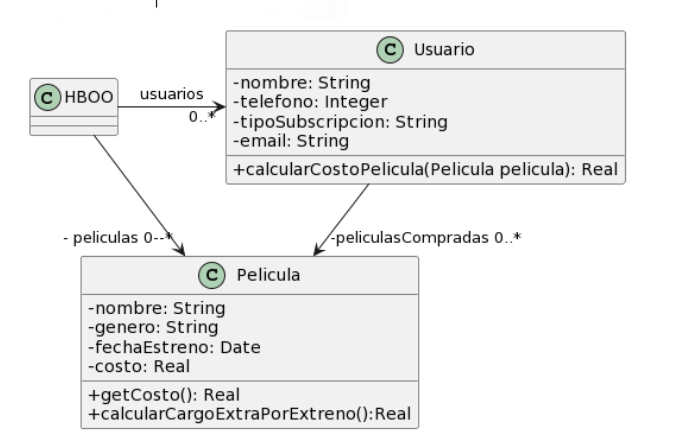

# Ejercicio 2
**Para cada una de las siguientes situaciones, realice en forma iterativa los siguientes pasos:**
1. indique el mal olor, <br/>
2. indique el refactoring que lo corrige, <br/> 
3. aplique el refactoring, mostrando el resultado final (código y/o diseño según corresponda). <br/>
> Si vuelve a encontrar un mal olor, retorne al paso (i).


## 2.6 Peliculas
```java
public class Usuario {
    String tipoSubscripcion;
    // ...

    public void setTipoSubscripcion(String unTipo) {
   	    this.tipoSubscripcion = unTipo;
    }
    
    public double calcularCostoPelicula(Pelicula pelicula) {
        double costo = 0;
        if (tipoSubscripcion=="Basico") {
            costo = pelicula.getCosto() + pelicula.calcularCargoExtraPorEstreno();
        }
        else if (tipoSubscripcion== "Familia") {
            costo = (pelicula.getCosto() + pelicula.calcularCargoExtraPorEstreno()) * 0.90;
        }
        else if (tipoSubscripcion=="Plus") {
            costo = pelicula.getCosto();
        }
        else if (tipoSubscripcion=="Premium") {
            costo = pelicula.getCosto() * 0.75;
        }
        return costo;
    }
}

public class Pelicula {
    LocalDate fechaEstreno;
    // ...

    public double getCosto() {
   	    return this.costo;
    }
    
    public double calcularCargoExtraPorEstreno(){
        // Si la Película se estrenó 30 días antes de la fecha actual, retorna un cargo de 0$, caso contrario, retorna un cargo extra de 300$
        return (ChronoUnit.DAYS.between(this.fechaEstreno, LocalDate.now()) ) > 30 ? 0 : 300;
    }
}
```
## Refactor 1 
### **Bad Smell:** Switch Statement
La clase `Usuario` tiene el metodo `calcularCostoPelicula()` con un condicional muy grande, se puede crear una interface. 
### **Refactoring:** Replace Conditional with Polymorphism 
Creo una interface `tipoSubscripcion` y que cada subclase tenga su propio `calcularCostoPelicula()`.
```java
public class Usuario {
    private Subscripcion tipoSubscripcion;
    // ...

    public void setTipoSubscripcion(Subscripcion unTipo) {
   	    this.tipoSubscripcion = unTipo;
    }
    
    public double calcularCostoPelicula(Pelicula pelicula) {
        return this.tipoSubscripcion.calcularCostoPelicula(pelicula);
    }
}

public interface Subscripcion {
    public double calcularCostoPelicula(Pelicula pelicula);
}

public class SubscripcionBasica implements Subscripcion {
    @Override
    public double calcularCostoPelicula(Pelicula pelicula) {
        return pelicula.getCosto() + pelicula.calcularCargoExtraPorEstreno();
    }
}

public class SubscripcionFamilia implements Subscripcion {
    @Override
    public double calcularCostoPelicula(Pelicula pelicula) {
        return (pelicula.getCosto() + pelicula.calcularCargoExtraPorEstreno()) * 0.90;
    }
}

public class SubscripcionPlus implements Subscripcion {
    @Override
    public double calcularCostoPelicula(Pelicula pelicula) {
        return pelicula.getCosto();
    }
}

public class SubscripcionPremium implements Subscripcion {
    @Override
    public double calcularCostoPelicula(Pelicula pelicula) {
        return pelicula.getCosto() * 0.75;
    }
}

public class Pelicula {
    LocalDate fechaEstreno;
    // ...

    public double getCosto() {
   	    return this.costo;
    }
    
    public double calcularCargoExtraPorEstreno(){
        // Si la Película se estrenó 30 días antes de la fecha actual, retorna un cargo de 0$, caso contrario, retorna un cargo extra de 300$
        return (ChronoUnit.DAYS.between(this.fechaEstreno, LocalDate.now()) ) > 30 ? 0 : 300;
    }
}
```
